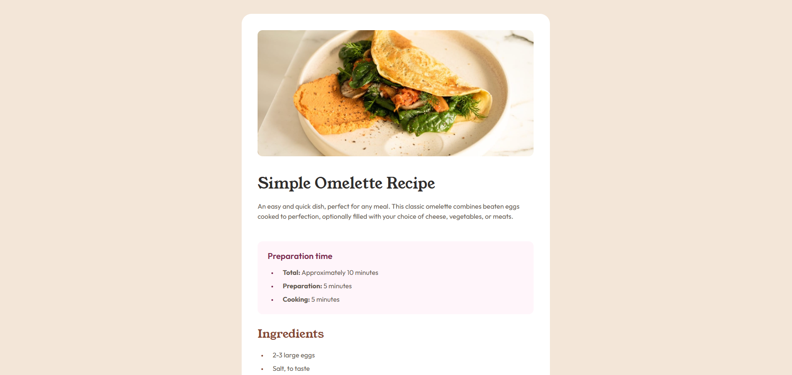

# Frontend Mentor - Recipe page solution

This is a solution to the [Recipe page challenge on Frontend Mentor](https://www.frontendmentor.io/challenges/recipe-page-KiTsR8QQKm). Frontend Mentor challenges help you improve your coding skills by building realistic projects.

## Overview

### Screenshot

### Links

- Solution URL: [Live Site URL](https://celthros.github.io/recipe-page-challenge/)

## My process

### Built with

- Semantic HTML5 markup
- CSS custom properties
- Flexbox
- CSS Grid
- Mobile-first workflow
- [Styled Components](https://styled-components.com/) - For styles

### What I learned

I improved my approach to SCSS and component structure, implemented a table at the end of the file, and standardized the styling of headings and unordered lists.

## Author

- Website - [Github](https://github.com/Celthros)
- Frontend Mentor - [@Celthros](https://www.frontendmentor.io/profile/Celthros)
